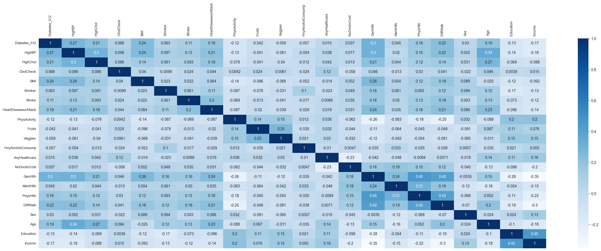
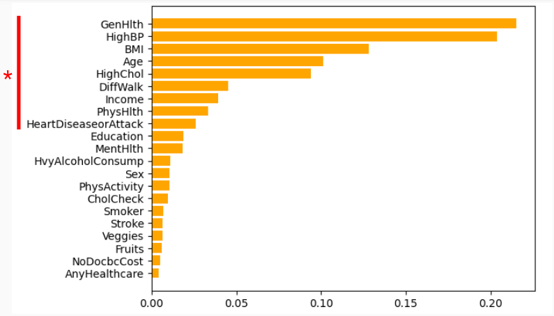

# Diabetes Prediction Using CDC Survey
Classifying diabetes project

### [Erdos Institute](https://www.erdosinstitute.org/) Data Science Boot Camp - Fall 2023

#### Team Members
- [Donna Chen](https://www.linkedin.com/in/donna-chen-1b245a19b/)
- [Gary Hu]()
- [Michelle Lobb](https://www.linkedin.com/in/michelle-lobb-94a038222/)
- [Shayne Plourde](https://www.linkedin.com/in/shayne-plourde/)

#### Links
[Tableu Dashboard](https://public.tableau.com/views/ErdosBiomedicalCategorization/Dashboard2?:language=en-US&:display_count=n&:origin=viz_share_link)

## Project Overview
Diabetes is a major issue in the world, impacting 8.5% of adults and killing 1.5 million people in 2019 according to the World Health Organization. Diabetes is a chronic disease that affects how the body regulates blood glucose levels. Over time, having raised blood glucose levels may lead to serious damage to the nerves and blood vessels, leading to further complications. 

The goal of this project is to better understand the relationship between lifestyle factors and diabetes and subsequently predict whether an individual has diabetes or not, based on a survey questionnaire.

### Dataset used:
The Centers for Disease Control and Prevention annually collects a health-related telephone survey known as the Behavioral Risk Factor Surveillance System (BRFSS). This includes responses from over 400,000 Americans, containing healthcare statistics and lifestyle survey information, in addition to their diagnosis of diabetes. 

The Diabetes Health Indicators Dataset contains healthcare statistics and lifestyle survey information about people in general along with their diagnosis of diabetes. The 35 features consist of some demographics, lab test results, and answers to survey questions for each patient. The target variable for classification is whether a patient has diabetes, is pre-diabetic, or healthy.
https://www.kaggle.com/datasets/alexteboul/diabetes-health-indicators-dataset/data

###  Exploratory Data Analysis

Three data sets were included:
- A full data set with the following number of patients: 
    - 218,334 non-diabetic 
    - 35,346 diabetic
- A large data set with groups for only diabetic and non-diabetic
    - 213,703 non-diabetic
    - 4,631 pre-diabetic
    - 35,346 diabetic
- A balanced data set
    - 35,346 non-diabetic
    - 35,346 diabetic

We chose to use the imbalanced data as it has the most data.

The correlation between diabetes and the following characteristics was determined by a Spearman correlation >0.2:

 - HighBP
 - PhysHlth
 - DiffWalk
 - BMI
 - GenHlth
 - HighChol
 - HeartDiseaseorAttack
 - Age

## Results
The non-boosting methods for classification yielded accuracy scores capped at around 0.75, with the random forest model performing the best with 0.7562 accuracy, 0.7563 ROC AUC score, and 0.7961 recall on the balanced binary data set. The random forest model also provided relative importance scores for the features; the features with the highest importance scores were general health (0.2153), high blood pressure (0.2038), BMI (0.1279), age (0.1014), and high cholesterol (0.0937).

### Relative importance of features in random forest matches correlations

## Conclusions

Key features were identified and an XGBoost model was built which can correctly diagnose diabetes 82.1% of the time.
This could be used by clinicians to advise patients at risk for diabetes and help them generate intervention or treatment plans

Develop an app or survey to predict the likelihood of diabetes which could help medical professionals recommend further treatment or intervention. A minimal set of questions would be cheaper to administer and would result in a higher chance of individuals completing the survey.

Further, our data was from the CDC and US respondents. However, 80% of adults with diabetes live in lower-middle-income-countries. We would be interested in exploring if the features we found are the same for these countries as our App/survey would be much more impactful there. 

